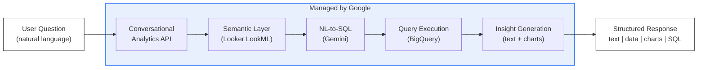
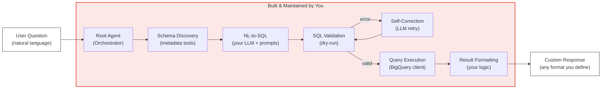
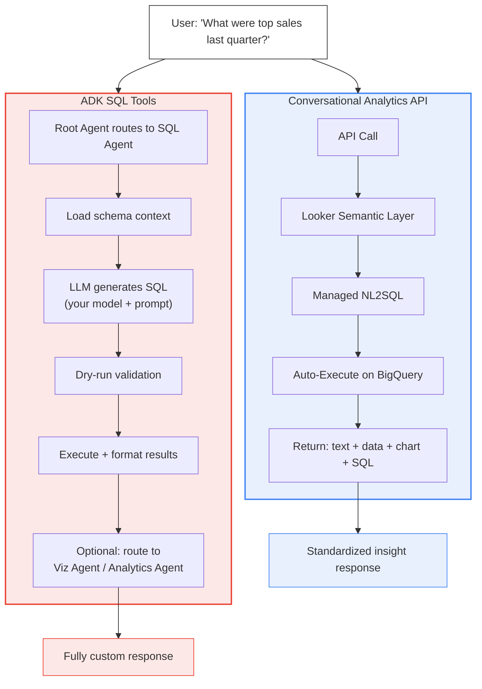
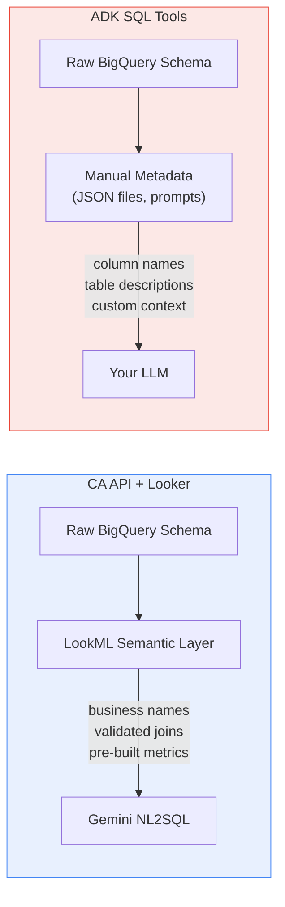
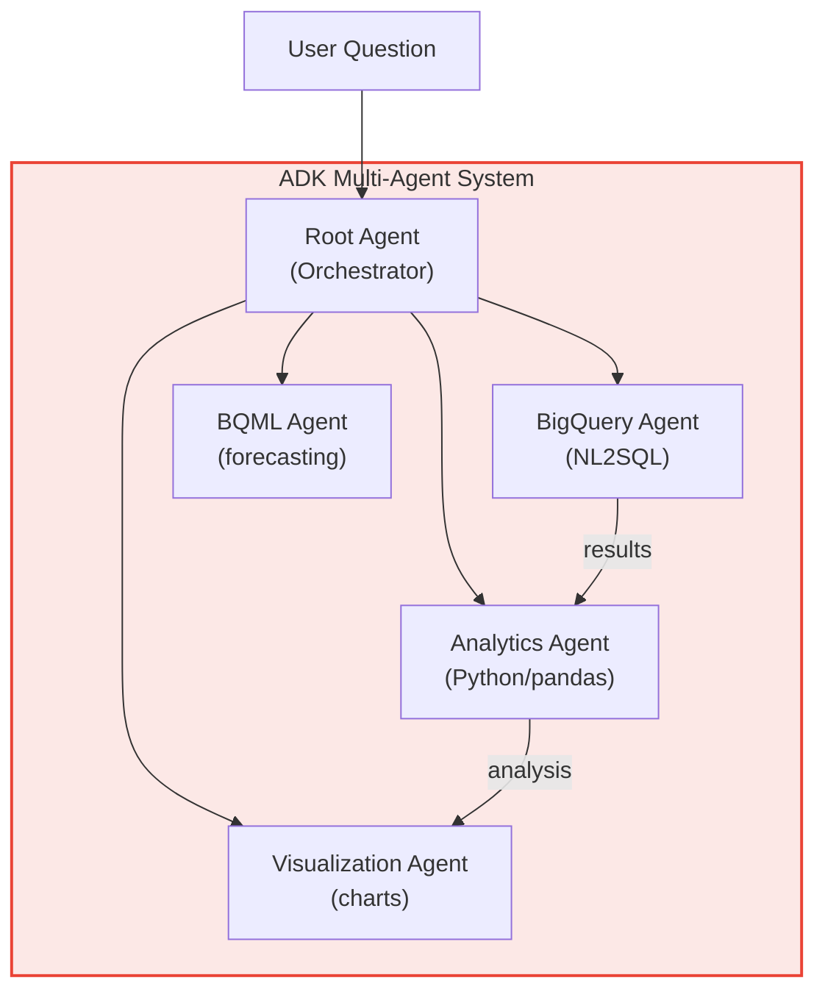
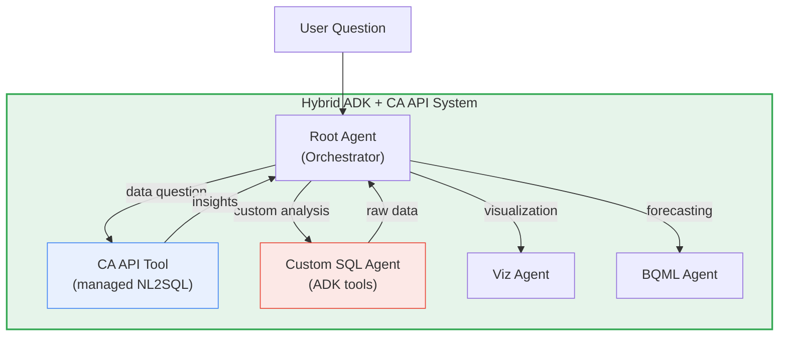

# Conversational Analytics API vs. ADK SQL Tools

**A technical comparison of two approaches to building natural language data agents on Google Cloud**

---

## The Problem Both Solve

Organizations want their teams to get answers from data using plain English — no SQL expertise required. Google Cloud offers two fundamentally different paths to build this:

| | Conversational Analytics API | ADK SQL Tools |
|---|---|---|
| **In one sentence** | A managed API that handles the entire NL-to-insight pipeline for you | A toolkit to build your own NL-to-SQL agent with full control |
| **Analogy** | Ordering a finished meal from a restaurant | Buying ingredients and cooking it yourself |

---

## TL;DR Comparison

| Dimension | Conversational Analytics API | ADK SQL Tools |
|:--|:--|:--|
| **What you build** | API integration layer | Full agent system |
| **SQL generation** | Managed by Google (Gemini-powered) | You control the LLM, prompts, and strategy |
| **Schema awareness** | Automatic discovery + Looker semantic layer | Manual schema loading or ADK `BigQueryToolset` |
| **Validation** | Built-in (blocks DDL/DML automatically) | You implement dry-run and correction loops |
| **Multi-agent** | Single-purpose (can be wrapped as a tool) | Native multi-agent orchestration |
| **Data sources** | BigQuery, Looker, AlloyDB, Cloud SQL, Spanner | Whatever you connect (BigQuery, AlloyDB, any DB) |
| **Customization** | Low — API parameters and system instructions | Full — prompts, models, validation, pipelines |
| **Time to production** | Days | Weeks |
| **Ongoing maintenance** | Low (managed service) | Higher (your code, your responsibility) |

---

## How Conversational Analytics API Works



### How it works step by step

1. **You send a natural language question** to the `DataChatServiceClient`
2. **The API resolves schema** automatically — if connected to Looker, it uses the LookML semantic layer (business-friendly names, pre-defined metrics, validated joins)
3. **Gemini generates SQL** internally, optimized by schema context and business glossary
4. **The query executes** against BigQuery (DDL/DML blocked by default)
5. **You receive a structured response** containing any combination of:
   - Text insights (natural language summary)
   - Schema insights (relevant tables/columns)
   - Data insights (query results as structured data)
   - Chart insights (visualization specifications)
   - The generated SQL (for transparency)

### Key characteristics

- **Multi-turn conversations** — the API maintains context within a session
- **Semantic layer advantage** — Looker integration reduces NL-to-SQL errors by ~66% compared to querying raw warehouse schemas
- **Built-in safety** — read-only by design, no risk of accidental data modification
- **Advanced analytics** — optional Python code interpreter for forecasting (`AI.FORECAST`) and anomaly detection

---

## How ADK SQL Tools Work



### How it works step by step

1. **A root agent receives the question** and decides which sub-agent handles it
2. **Schema discovery** — the agent calls metadata tools (`list_datasets`, `get_table_info`) or loads pre-configured schema files
3. **NL-to-SQL generation** — your chosen LLM (Gemini, Claude, etc.) generates SQL using your prompt strategy (baseline, CHASE-SQL, few-shot, etc.)
4. **Validation** — a dry-run against BigQuery catches syntax errors before execution
5. **Self-correction** — if validation fails, the LLM receives the error and regenerates (you control the retry budget)
6. **Execution** — the validated query runs via `BigQueryToolset.execute_sql` or a custom BigQuery client
7. **Result formatting** — you decide what the user sees: raw data, summaries, charts, or any custom format

### Key characteristics

- **Model flexibility** — use any LLM (Gemini 2.5 Pro for complex SQL, Flash for speed, or non-Google models)
- **Multi-agent orchestration** — route different question types to specialized agents (SQL agent, analytics agent, ML agent)
- **Custom validation** — implement business rules, query cost limits, or domain-specific SQL patterns
- **State management** — persist context, query history, and artifacts across tool calls via `ToolContext`

---

## Side-by-Side Architecture



---

## Key Differences Deep Dive

### Control and Customization

| | CA API | ADK SQL Tools |
|:--|:--|:--|
| Prompt engineering | System instructions only | Full prompt control per agent |
| Model selection | Gemini (managed) | Any LLM (Gemini, Claude, open-source) |
| Response format | Fixed structure (text/data/chart/SQL) | Any format you define |
| Pipeline logic | Opaque — you cannot modify intermediate steps | Transparent — every step is your code |

**Bottom line:** CA API trades customization for simplicity. ADK gives you full control at the cost of more engineering.

---

### Schema Awareness and Semantic Layer



| | CA API | ADK SQL Tools |
|:--|:--|:--|
| Schema discovery | Automatic | Manual or via `BigQueryToolset` metadata tools |
| Business context | Looker LookML (curated semantic layer) | You build it (metadata files, prompt context) |
| Schema freshness | Always current | Depends on your refresh strategy |
| Multi-source joins | Handled if modeled in Looker | You implement cross-source logic |

**Bottom line:** CA API's Looker integration provides a governed semantic layer that significantly improves accuracy. With ADK, you must build and maintain this context yourself.

---

### SQL Generation and Validation

| | CA API | ADK SQL Tools |
|:--|:--|:--|
| Generation strategy | Single managed pipeline | Your choice: baseline, CHASE-SQL, few-shot, chain-of-thought |
| Error recovery | Automatic | You build retry + self-correction loops |
| Write protection | Enforced (no DDL/DML) | Configurable (`WriteMode.BLOCKED` / `PROTECTED`) |
| Query cost control | Managed | You implement (dry-run, row limits, budget checks) |

---

### Multi-Agent Orchestration

CA API is a **single-purpose tool** — it answers data questions. ADK SQL Tools are **building blocks** for multi-agent systems.



With ADK, you can build pipelines where a SQL agent generates data, an analytics agent processes it, and a visualization agent creates charts — all coordinated by a root agent with a planning strategy.

CA API can participate in such a system **as one tool**, but it cannot orchestrate other agents.

---

### Cost and Latency

| | CA API | ADK SQL Tools |
|:--|:--|:--|
| Billing model | Per API call (bundled) | Per LLM call + BigQuery compute + infra |
| Typical latency | Optimized single round-trip | Variable — depends on validation retries |
| Scaling | Managed (auto) | You manage (Cloud Run, GKE, etc.) |
| Infrastructure | None (serverless API) | Cloud Run, Compute Engine, or Agent Engine |

---

### Security and Governance

| | CA API | ADK SQL Tools |
|:--|:--|:--|
| Authentication | IAM-based | IAM + custom auth (your responsibility) |
| Data access control | Inherits BigQuery/Looker permissions | You implement per-agent access rules |
| Audit logging | Built-in | You instrument (OpenTelemetry, Cloud Logging) |
| Write prevention | Enforced by API | Configurable — can accidentally allow writes if misconfigured |

---

## Decision Matrix

### Use Conversational Analytics API when:

| Scenario | Why CA API fits |
|:--|:--|
| You already use Looker with well-modeled LookML | The semantic layer dramatically improves accuracy |
| You need a production data agent in days, not weeks | Minimal code — just API integration |
| Your use case is straightforward Q&A over structured data | CA API is purpose-built for this |
| You want Google to manage model updates and optimizations | No model versioning or prompt maintenance |
| Non-technical teams need self-service analytics | Out-of-the-box chat experience |
| You need built-in support for multiple data sources | BigQuery, Looker, AlloyDB, Cloud SQL, Spanner |

### Use ADK SQL Tools when:

| Scenario | Why ADK fits |
|:--|:--|
| You need multi-agent orchestration | Root agent + specialized sub-agents |
| You require custom SQL generation strategies | CHASE-SQL, few-shot, domain-specific prompts |
| You want to use non-Google LLMs | Claude, GPT, open-source models |
| You need custom validation and self-correction pipelines | Dry-run + iterative LLM correction |
| Your pipeline goes beyond Q&A (ML, forecasting, custom viz) | Multi-agent workflows with BQML, Code Interpreter, etc. |
| You need deep control over every step of the pipeline | Full transparency and customization |

---

## The Hybrid Approach

These approaches are **not mutually exclusive**. You can use CA API as a tool inside an ADK multi-agent system:



**When this makes sense:**
- Use CA API for Looker-connected, well-governed data questions (leverages the semantic layer)
- Use custom ADK SQL tools for raw BigQuery exploration, complex multi-table queries, or non-standard SQL patterns
- Let the root agent decide which path to take based on the question type

---

## Code Examples

### Conversational Analytics API — Minimal Agent

```python
from google.cloud import geminidataanalytics
from google.adk import Agent

# Create the CA API client
ca_client = geminidataanalytics.DataChatServiceClient()

# Define CA API as an ADK tool
def get_insights(question: str) -> dict:
    """Ask a data question using Conversational Analytics API."""
    datasource = geminidataanalytics.DatasourceReferences(
        looker_explore=geminidataanalytics.LookerExploreReference(
            client_id="your-client-id",
            client_secret="your-client-secret",
            instance_uri="https://your-instance.looker.com",
            lookml_model="your_model",
            explore="your_explore",
        )
    )

    request = geminidataanalytics.ChatRequest(
        parent="projects/your-project/locations/us-central1",
        datasource_references=[datasource],
        messages=[geminidataanalytics.Message(author="USER", content=question)],
    )

    response = ca_client.chat(request=request)

    return {
        "text": response.text_insights,
        "data": response.data_insights,
        "chart": response.chart_insights,
        "sql": response.schema_insights,
    }

# Wire it into an ADK agent
agent = Agent(
    model="gemini-2.5-flash",
    name="data_agent",
    tools=[get_insights],
    instruction="You answer data questions. Use get_insights for any data query.",
)
```

### ADK SQL Tools — Custom NL2SQL Agent

```python
from google.adk import Agent
from google.adk.tools.bigquery import BigQueryToolset, BigQueryToolConfig, WriteMode
from google.genai import Client

llm = Client()

# Configure BigQuery toolset (built-in schema + execution tools)
bq_toolset = BigQueryToolset(
    tool_filter=["execute_sql"],
    bigquery_tool_config=BigQueryToolConfig(
        write_mode=WriteMode.BLOCKED,
        max_query_result_rows=50,
    ),
)

# Custom NL2SQL tool with full control
def nl2sql(question: str, tool_context) -> str:
    """Generate SQL from a natural language question."""
    schema = tool_context.state.get("schema_context", "")

    response = llm.models.generate_content(
        model="gemini-2.5-pro",
        contents=f"""You are a BigQuery SQL expert.

Schema:
{schema}

Generate a SELECT query for: {question}

Rules:
- Use fully qualified table names with backticks
- Never use SELECT *
- Always include a LIMIT clause
""",
        config={"temperature": 0.1},
    )

    sql = response.text.replace("```sql", "").replace("```", "").strip()
    tool_context.state["last_sql"] = sql
    return sql

# Build the agent with both custom and built-in tools
sql_agent = Agent(
    model="gemini-2.5-flash",
    name="sql_agent",
    tools=[nl2sql, bq_toolset],
    instruction="""You are a data analyst agent.
1. Use nl2sql to generate SQL from the user's question
2. Use execute_sql to run the query
3. Summarize the results clearly""",
)
```

---

## Summary

```
Conversational Analytics API        ADK SQL Tools
          │                               │
     Managed meal                  Cook from scratch
     ─────────                     ────────────────
     Fast to deploy                Full control
     Semantic layer                Any LLM / any strategy
     Single-purpose                Multi-agent capable
     Less code                     More code, more power
          │                               │
          └───────── Can be combined ──────┘
```

Choose CA API for **speed and governance**. Choose ADK SQL Tools for **control and orchestration**. Combine both when your system needs the strengths of each.

---

*Built with Google Cloud, Agent Development Kit (ADK), and Conversational Analytics API.*
